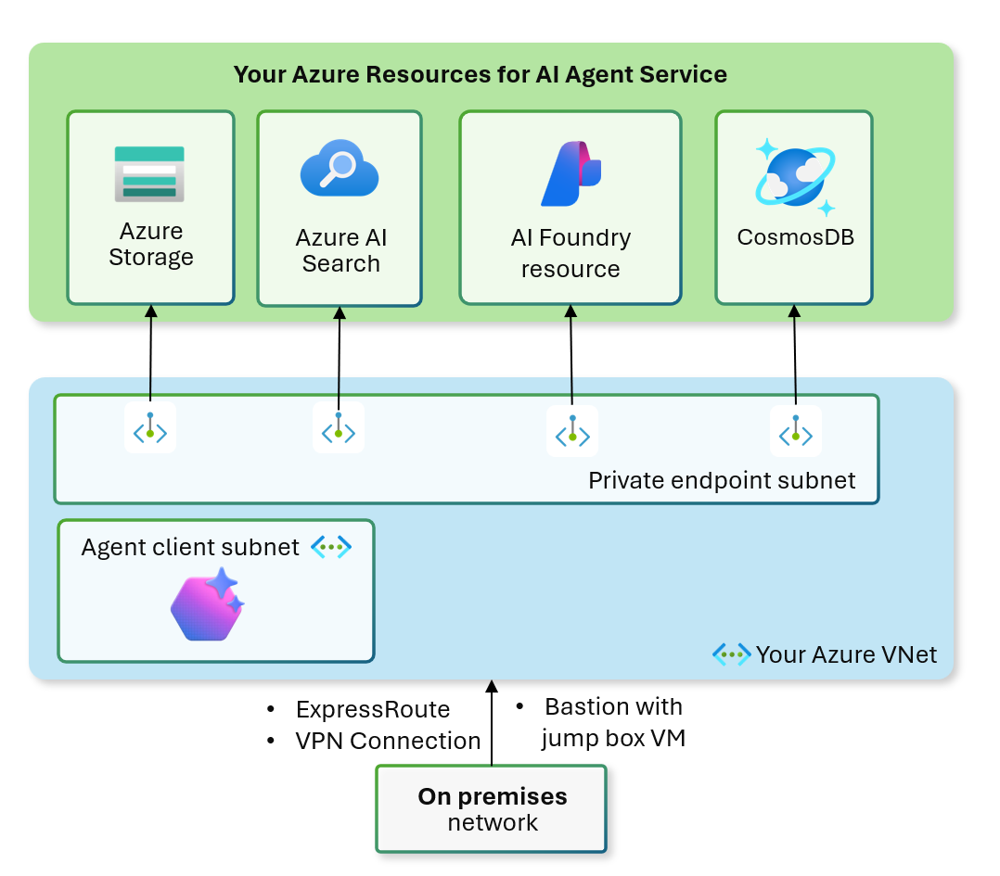

# Agents and Stateful Data

This repo provides a deeper look at the ephemeral data stored in the Azure AI FOundry Agent service.

See more here: https://learn.microsoft.com/en-us/azure/ai-foundry/responsible-ai/openai/data-privacy?tabs=azure-portal#how-does-azure-ai-foundry-process-data-to-provide-azure-direct-models

## Overview: Foundry Agent Service

When you use an Agent, there are a series of steps that are involved.

- **Creating an agent:** You create an agent to start sending messages and receiving responses.  
- **Creating a thread:** You create a thread once and append messages to it as users reply. This ensures that the conversation history is maintained and managed automatically.  
- **Sending messages:** Messages can be sent by both the agent and the user. These messages can include text, images, and other files, providing a rich interaction experience.  
- **Running the agent:** When a run is initiated, the agent processes the messages in the thread and performs tasks based on its configuration. It may append new messages to the thread as part of its response.  
- **Check the run status:** Monitor the run until it has completed.  
- **Getting the response:** After the agent has created a response, display it to the user.  

The Azure AI Foundry Agent Service is a "Stateful API" -> This means it retains data between calls.

Stateful entities created during usage:
- Threads
  - Threads are conversation sessions between an agent and a user. They store messages and automatically handle truncation to fit content into a model’s context. 
- Messages
  - Messages are the individual pieces of communication within a thread. They can be created by either the agent or the user and can include text, or other files. Messages are stored as a list within the thread, allowing for a structured and organized conversation flow. You can attach up to 100,000 messages to a single thread.
- Runs
  - A run involves invoking the agent on the thread, where it processes the messages in the thread and may append new messages (responses from the agent). The agent uses its configuration and the thread’s messages to perform tasks by calling models and tools. As part of a run, the agent appends messages to the thread.

Additionally, files can be uploaded during Foundry Agent Service setup or as part of a message, these will also be stored in the service.

Data stored in the vector indexes and Content Safety services is out of scope for the purposes of this investigation, but the service will also use these to store data in relation to the threads and tasks performed by agents.
The index will naturally contain document chunks and text relating to uploaded files.

### Where is data stored?

Azure AI Foundry Agent Service endpoints are regional, and data is stored in the same region as the endpoint.

You can control where data is stored, using 1 of 2 options:

**Default:** Secure, Microsoft-managed storage account that is logically separated, created during resource setup.  
**Custom / BYO:** Your own Azure resources, giving you full ownership and control.
Learn more at:
[Use your own resources in the Azure AI Foundry Agent Service | Microsoft Learn](https://learn.microsoft.com/en-us/azure/ai-foundry/agents/how-to/use-your-own-resources)



### Setup Options:

**Basic Setup:**
Compatible with OpenAI Assistants
Manages agent states using the platform's built-in storage.  
Includes the same tools and capabilities as the Assistants API
Added support for non-OpenAI models and tools such as Azure AI Search, and Bing.  
**Standard Setup:**  
Includes everything in the basic setup
Fine-grained control using your own Azure resources.  
All customer data (incl. files, threads, and vector stores) stored in your own Azure resources.  
**Standard Setup with Bring Your Own (BYO) Virtual Network:**  
Includes everything in the Standard Setup
Ability to operate entirely within your own virtual network.  
Bring Your Own Virtual Network (BYO virtual network), keeping traffic confined to your network environment.  
See full details [here](https://github.com/azure-ai-foundry/foundry-samples/tree/main/samples/microsoft/infrastructure-setup/15-private-network-standard-agent-setup)

### Bring Your Own (BYO) Azure Resources: Overview  
This ensures all sensitive data remains under your control.  
All agents created using the service are stateful, meaning they retain information across interactions. With this setup, agent states are automatically stored in customer-managed, single-tenant resources.  

Standard setup enforces project-level data isolation by default.  
Two blob storage containers will automatically be provisioned in your storage account, one for files and one for intermediate system data (chunks, embeddings) and three containers will be provisioned in your Cosmos DB, one for user systems, one for system messages, and one for user inputs related to created agents such as their instructions, tools, name, etc. This default behavior was chosen to reduce setup complexity while still enforcing strict data boundaries between projects.

The required Bring Your Own Resources include:  

**BYO Search:**
All vector stores created by the agent leverage the your Azure AI Search resource.

**BYO File Storage:**  
All files uploaded by developers (during agent configuration) or end-users (during interactions) are stored directly in the customer’s Azure Storage account.  

Files stored in Azure Storage can be found in the following containers, and blobs, stored under a GUID mapping to the associated Agent:

4d194f72-3412-46da-877d-8401970389d7-30ce85cc884e-azureml-agent
- embeddingcache-assistant-UvLWpw7iX93rVFBz4MQqDz  
  - contains embeddings used by assistant on uploaded file.
- fulltext-assistant-UvLWpw7iX93rVFBz4MQqDz
  - full text content of the uploaded file
-- sample of the embeddings blob, using german Government tax documentation:
```json
embeddingcache-assistant-UvLWpw7iX93rVFBz4MQqDz
{"doc":{"id":"assistant-UvLWpw7iX93rVFBz4MQqDz","content":["\n\n\n\n\n\n\n\n\n\n\n\n\n\n\n\n\n\n\n\n\n\n\n\n\n\n\n\n\n\n\n\n\n\n\n\n\n\n\n\n\n\n\n\n\n\n\nSteuern von A bis Z, Ausgabe2025\n\n\nA\nu\n\nsg\nab\n\ne \n20\n\n25\n\n S\nte\n\nue\nrn\n\n v\non\n\n A\n–Z\n\n \n\n\n\n\n\nIn einem Gemeinwesen gibt es viele Aufgaben, die ein \nEinzelner oder eine Einzelne nicht lösen kann: Bildung \nund öffentliche Infrastruktur, Gesundheitswesen und \nsoziale Absicherung, innere und äußere Sicherheit \ngehören beispielsweise dazu. Hier wird der Staat für \nuns alle tätig. Seine Leistungen finanziert er mit den \nSteuereinnahmen. Sie sind seine wichtigste Einnahme-\nquelle. Ohne diese Gelder könnte er seinen Aufgaben \nnicht nachkommen.\n\nDie vorliegende Broschüre gibt einen Überblick über \ndie wesentlichen steuerrechtlichen Grundsätze und  \nBestimmungen sowie über die verschiedenen Steuer-\narten in Deutschland.\n\nDas Bundesministerium der Finanzen\n\nWarum zahlen wir Steuern?\n\n \nWas Steuern sind und wozu wir sie zahlen\n\nVorwort\n\nhttps://www.bundesfinanzministerium.de/Content/DE/Video/Finanzisch/steuern/steuern.html\nhttps://www.bundesfinanzministerium.de/Content/DE/Downloads/Broschueren_Bestellservice/was-steuern-sind-und-wozu-wir-sie-zahlen.pdf?__blob=publicationFile&v=7\n\n\nInhalt\n\nSteuern und Abgaben: Ein Überblick in Fakten und Zahlen 6\nAbgabenordnung 7\n\nSteuerberatung (Hilfeleistung in Steuersachen) 13\n\nSteuerrechtsprechung  15\n\nInternationales und supranationales Steuerrecht 16\n\nEinteilung der Steuern 22\nDie Steuerkompetenzen auf einen Blick 25\n\nDie einzelnen Steuern in  alphabetischer Folge 28\nAbgeltungsteuer 29\n\nAbzugsteuern bei beschränkt Steuerpflichtigen 32\n\nAlkoholsteuer 34\n\nAlkopopsteuer 36\n\nBesitz- und Verkehrsteuern 37\n\nBiersteuer 38\n\nEinfuhrumsatzsteuer 40\n\nEinkommensteuer 42\n\nEnergiesteuer 54\n\nErbschaftsteuer/Schenkungsteuer 58\n\nFeuerschutzsteuer 66\n\nGetränkesteuer 67\n\nGewerbesteuer 68\n\nGrunderwerbsteuer 70\n\nGrundsteuer 72\n\nHundesteuer 76\n\nJagd- und Fischereisteuer 77\n\nKaffeesteuer 78\n\n4\n\n\n\nKapitalertragsteuer 79\n\nKirchensteuer 81\n\nKörperschaftsteuer 83\n\nKraftfahrzeugsteuer 86\n\nLohnsteuer 90\n\nLuftverkehrsteuer 97\n\nMindeststeuer 99\n\nÖrtliche Steuern 100\n\nRennwett- und Lotteriesteuer 101\n\nSchankerlaubnissteuer 103\n\nSchaumweinsteuer 104\n\nSolidaritätszuschlag 105\n\nSpielbankabgabe 107\n\nSteuerabzug bei Bauleistungen 108\n\nSteueridentifikationsnummer  110\n\nStromsteuer 111\n\nTabaksteuer 114\n\nUmsatzsteuer 119\n\nVerbrauchsteuern (besondere) 127\n\nVergnügungsteuer 128\n\nVersicherungsteuer 129\n\nZölle 131\n\nZweitwohnungsteuer 134\n\nZwischenerzeugnissteuer 135\n\nAbkürzungsverzeichnis 138\nRegister 140\n\n5\n\n\n\n6\n\n Steuern und  \n Abgaben:  \n Ein Überblick  \n in Fakten  \n und Zahlen \n\n\n\n7Abgabenordnung\n\nAbgabenordnung\n\nAllgemeine Regeln\n\nDie für alle Steuern geltenden gemeinsamen Regeln, insbesondere \ndiejenigen zum Besteuerungsver
...
946,-0.032984018325805664,0.02516789920628071,0.055372852832078934,-0.049710508435964584,0.02553265169262886,-0.03329665958881378,0.034026164561510086,0.04383973404765129,0.058117177337408066,0.004264126531779766,-0.07176932692527771,0.04314497113227844,-0.005644973833113909,0.0036214678548276424,-0.048251498490571976,0.003295796224847436,-0.0297359861433506,-0.013443722389638424,0.12610003352165222,0.05314959958195686,0.017742587253451347,-0.0896248146891594,-0.07399258017539978,0.07065770030021667,0.09733671694993973,-0.07065770030021667,0.0024729326833039522,0.09455765783786774,0.020964564755558968,0.02160722389817238,-0.042728111147880554,0.0101435836404562,0.06648910790681839,-0.0716998502612114,0.03142079338431358,0.044291332364082336,0.07955070585012436,0.00500665744766593,-0.04047011956572533,0.07420101016759872,0.001320055453106761,0.07559054344892502,0.05790874734520912,0.012141035869717598,0.07003241777420044],"token_length":725,"tenant_id":null},{"id":"99d69bbc-7818-48e2-99f9-35605378922c","text":"Steuerpflichtigen \n\t Alkoholsteuer \n\t Alkopopsteuer \n\t Besitz- und \n Verkehrsteuern \n\t Biersteuer \n\t Einfuhrumsatzsteuer \n\t Einkommensteuer \n\t Energiesteuer \n\t Erbschaftsteuer/ \n Schenkungsteuer \n\t Feuerschutzsteuer \n\t Getränkesteuer \n\t Gewerbesteuer \n\t Grunderwerbsteuer \n\t Grundsteuer \n\t Hundesteuer \n\t Jagd- und \n Fischereisteuer \n\t Kaffeesteuer \n\t Kapitalertragsteuer \n\t Kirchensteuer \n\t Körperschaftsteuer \n\t Kraftfahrzeugsteuer \n\t Lohnsteuer \n\t Luftverkehrsteuer \n\t Mindeststeuer \n\t Örtliche Steuern \n\t Rennwett- und \n Lotteriesteuer \n\t Schankerlaubnis- \n steuer \n\t Schaumweinsteuer \n\t Solidaritätszuschlag \n\t Spielbankabgabe \n\t Steuerabzug bei \n Bauleistungen \n\t Steueridentifikationsnummer \n\t Stromsteuer \n\t Tabaksteuer \n\t Umsatzsteuer \n\t Vergnügungsteuer \n\t Versicherungsteuer \n\t Zölle \n\t Zweitwohnungsteuer \n\t Zwischenerzeugnissteuer \n\tAbkürzungsverzeichnis\n\tRegister\n\tImpressum","metadata":{"source":"file","source_name":"steuern-von-a-z.pdf","url":null,"created_at":"2025-10-22T12:03:16.849178+00:00","file_created_at":null,"file_modified_at":null,"mimetype":"application/pdf","source_mimetype":null,"version":null,"reader_ids":null,"num_pages":146,"authorization_policy":"default","allow_all_readers":null,"document_id":"assistant-UvLWpw7iX93rVFBz4MQqDz","image_asset_pointers":[],"user_metadata":{},"vocabulary":null,"requires_fga_filtering":false,"content_location":null},"embedding":[0.05474122613668442,0.04454757273197174,-0.015654534101486206,0.07757765054702759,  
...  
013635661453008652,0.07929865270853043,0.08088727295398712,0.00438525527715683,0.04957820847630501],"token_length":528,"tenant_id":null}],"total_token_length":140048},"chunking_strategy":{"max_chunk_size_tokens":800,"chunk_overlap_tokens":400,"override_chunk_level_modification_time":false}}
```

4d194f72-3412-46da-877d-8401970389d7-azureml-blobstore
- - Used to store files related to AI Foundry and AML, does not appear to be used when using a custom setup, but it is still automatically provisioned when I create the network and storage isolated environment.

aiservices-63117838-b933-5f54-aa0f-b638ca1abc1c
- - Contains the uploaded and generated files, used by ai services.
- assistant-UvLWpw7iX93rVFBz4MQqDz
  - Blob contains the uploaded file
**BYO Thread Storage:**
All messages and conversation history will be stored in the your own Azure Cosmos DB account.
By bundling these BYO features (file storage, search, and thread storage), the standard setup guarantees that your deployment is secure by default.  
All data processed by Azure AI Foundry Agent Service is automatically stored at rest in your own Azure resources, helping you meet internal policies, compliance requirements, and enterprise security standards.

Messages and content stored in Azure CosmosDB have the following form in Cosmos container called **enterprise memory**:

4d194f72-3412-46da-877d-8401970389d7-agent-entity-store
  - contains items relating to the configuration of each agent
```json
{
    "hard_deleted_at": null,
    "internal_metadata": {},
    "azure_resource_location": null,
    "_etag": "\"85009643-0000-4700-0000-68f8c80e0000\"",
    "internal_note": null,
    "created_at": "2025-10-22T08:24:01.559817+00:00",
    "updated_at": "2025-10-22T12:03:26.908371+00:00",
    "deleted_at": null,
    "id": "ent_msg_3sTAI8nyXDZnjmekb6TFzwcz",
    "partition_key_value": "4d194f72-3412-46da-877d-8401970389d7_2025_10",
    "payload": {
        "type": "agent",
        "id": "asst_dwNxfzYYnXikupXQp2lEYJZM",
        "name": "Agent261",
        "description": "",
        "instructions": "You are a helpful agent that can answer questions on German tax law.",
        "tools": [
            {
                "type": "file_search",
                "vector_store_ids": [],
                "max_num_results": null,
                "reranker_settings": null,
                "ranking_options": {
                    "ranker": "auto",
                    "score_threshold": 0
                },
                "filters": null
            },
            {
                "type": "retrieval"
            }
        ],
        "metadata": {}
    },
    "kind": "enterprise_entity_message",
    "_rid": "rYp3AIBIE-0BAAAAAAAAAA==",
    "_self": "dbs/rYp3AA==/colls/rYp3AIBIE-0=/docs/rYp3AIBIE-0BAAAAAAAAAA==/",
    "_attachments": "attachments/",
    "_ts": 1761134606
}
```

4d194f72-3412-46da-877d-8401970389d7-system-thread-message-store
  - Contains items relating to system messages, such as the uploading of files and setting up of the agent.
```json
{
    "hard_deleted_at": null,
    "internal_metadata": {},
    "azure_resource_location": "swedencentral",
    "_etag": "\"00003000-0000-4700-0000-68f8c2c20000\"",
    "internal_note": null,
    "created_at": "2025-10-22T11:40:50.052097+00:00",
    "updated_at": "2025-10-22T11:40:50.352341+00:00",
    "deleted_at": null,
    "id": "ent_msg_zpLFRZ8qrW5gJRKWE1g8G7g9",
    "thread_id": "thread_mkfBbkFUSz3X2owV46al60xz",
    "organization_id": "0faf32fe1c654d9cbc18b5b0479b437b",
    "content": "Z0FBQUFBQm8t <...snipped...> HRVhRPT0=",
    "kind": "enterprise_system_message",
    "_rid": "rYp3AOcircsBAAAAAAAAAA==",
    "_self": "dbs/rYp3AA==/colls/rYp3AOcircs=/docs/rYp3AOcircsBAAAAAAAAAA==/",
    "_attachments": "attachments/",
    "_ts": 1761133250
}
```
```json
{
    "hard_deleted_at": null,
    "internal_metadata": {},
    "azure_resource_location": "swedencentral",
    "_etag": "\"00004300-0000-4700-0000-68f8c83d0000\"",
    "internal_note": null,
    "created_at": "2025-10-22T12:04:11.755598+00:00",
    "updated_at": "2025-10-22T12:04:13.876954+00:00",
    "deleted_at": null,
    "id": "ent_msg_B0zLE11tzTBNCA6QcdE9iZ30",
    "thread_id": "thread_mkfBbkFUSz3X2owV46al60xz",
    "organization_id": "0faf32fe1c654d9cbc18b5b0479b437b",
    "content": "Z0FBQUFBQm8tTWc <...snipped...> kJoNHhlSVRIRT0=",
    "kind": "enterprise_system_message",
    "_rid": "rYp3AOcircsIAAAAAAAAAA==",
    "_self": "dbs/rYp3AA==/colls/rYp3AOcircs=/docs/rYp3AOcircsIAAAAAAAAAA==/",
    "_attachments": "attachments/",
    "_ts": 1761134653
}
```

4d194f72-3412-46da-877d-8401970389d7-thread-message-store
  - Contains copies of the messages exchanged by agents and users

```json
{
    "hard_deleted_at": null,
    "internal_metadata": {},
    "azure_resource_location": null,
    "_etag": "\"d40213a6-0000-4700-0000-68f8c2c20000\"",
    "internal_note": null,
    "created_at": "2025-10-22T11:40:50.453480+00:00",
    "updated_at": "2025-10-22T11:40:50.453937+00:00",
    "deleted_at": null,
    "id": "ent_msg_pHeEvB0yeSG9fOYPzJ37zRfI",
    "thread_id": "thread_mkfBbkFUSz3X2owV46al60xz",
    "metadata": {},
    "content": {
        "type": "rich_text",
        "content": [
            {
                "type": "text",
                "text": "When do I need to submit my tax return?"
            }
        ]
    },
    "file_citations": [],
    "webpage_citations": [],
    "file_paths": [],
    "kind": "enterprise_user_store",
    "_rid": "rYp3ANshX4EBAAAAAAAAAA==",
    "_self": "dbs/rYp3AA==/colls/rYp3ANshX4E=/docs/rYp3ANshX4EBAAAAAAAAAA==/",
    "_attachments": "attachments/",
    "_ts": 1761133250
}
```
```json
{
    "hard_deleted_at": null,
    "internal_metadata": {},
    "azure_resource_location": null,
    "_etag": "\"d40229a7-0000-4700-0000-68f8c2c80000\"",
    "internal_note": null,
    "created_at": "2025-10-22T11:40:53.344632+00:00",
    "updated_at": "2025-10-22T11:40:56.370019+00:00",
    "deleted_at": null,
    "id": "ent_msg_AO9g68cn7HtCIaRenQlTAqgZ",
    "thread_id": "thread_mkfBbkFUSz3X2owV46al60xz",
    "metadata": {},
    "content": {
        "type": "text",
        "text": "In Germany, the deadline for submitting your tax return depends on whether you are required to file a return or if you are filing voluntarily. Here's a breakdown:\n\n### **1. Obligatory Tax Filing:**\nIf you are required to file a tax return (e.g., due to additional sources of income or special circumstances), the general deadlines are:\n\n- **Without a tax advisor:**  \n  You must submit your tax return by **October 2 of the following year** (extended from July 31 due to pandemic-related changes). For example, the 2022 tax return must be submitted by October 2, 2023, because October 1 (the official deadline) falls on a Sunday.  \n\n- **With a tax advisor or Lohnsteuerhilfeverein (Income Tax Help Association):**  \n  The deadline is extended to **August 31 of the second following year**. For example, the 2022 tax return must be submitted by August 31, 2024.\n\n### **2. Voluntary Tax Filing:**\nIf you're filing voluntarily (e.g., to claim a refund due to overpaid taxes), you can submit your tax return **up to four years after the end of the respective tax year**. For example, you have until **December 31, 2026** to file a voluntary return for the 2022 tax year.\n\n### **What if you miss the deadline?**\nIf you miss the obligatory filing deadline, you may face penalties such as late fees or increased interest on any owed tax amounts. Additionally, the tax office may issue an **estimated assessment**. If you're running late, you can contact your local **Finanzamt** to request an extension, but this is subject to approval.\n\nLet me know if you need clarification on any of these points!"
    },
    "file_citations": [],
    "webpage_citations": [],
    "file_paths": [],
    "kind": "enterprise_user_store",
    "_rid": "rYp3ANshX4EDAAAAAAAAAA==",
    "_self": "dbs/rYp3AA==/colls/rYp3ANshX4E=/docs/rYp3ANshX4EDAAAAAAAAAA==/",
    "_attachments": "attachments/",
    "_ts": 1761133256
}
```

### Managing Stored Data

Data will be persisted indefinitely unless deleted.  
Use the delete function with the thread ID of the thread you want to delete to delete associated data.  
You can use customer managed keys (CMK) to add an additional layer of encryption to data stored in your own resources.  

There are also sample repos showing how to clean up agent data such as:

[https://github.com/frdeange/AifoundryAgentsCleaner](https://github.com/frdeange/AifoundryAgentsCleaner)

Deleting an Agent by it's ID, will not delete the associated thread messages or any files stored in containers relating to the agent.
Likewise, the document_chunks_hnsw_tnt... index is also still found in the search service after agent deletion.

